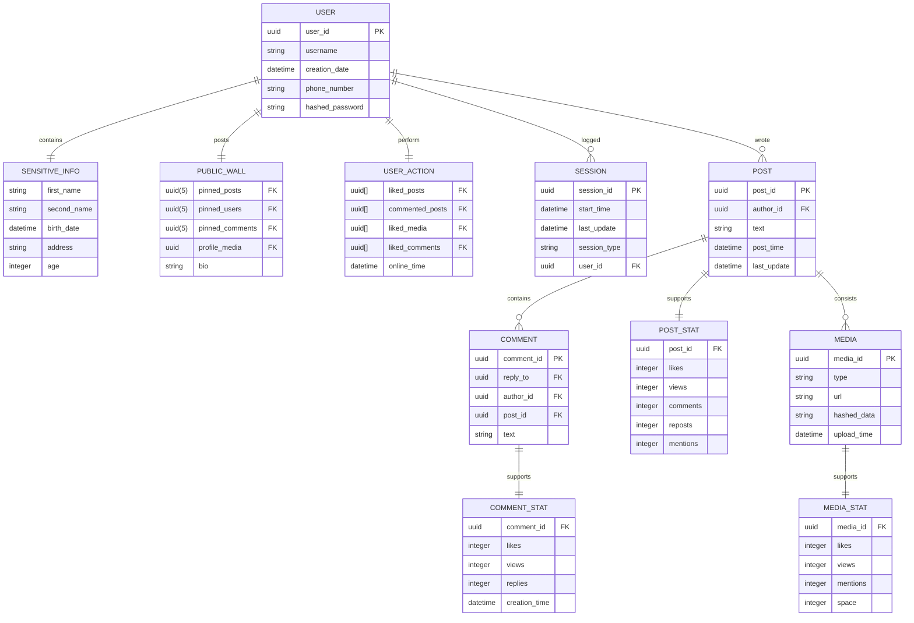

```mermaid
erDiagram
    USER ||--|| SENSITIVE_INFO : contains
    USER ||--|| PUBLIC_WALL : posts
    USER ||--|| USER_ACTION : perform
    USER ||--o{ SESSION : logged
    USER ||--o{ POST : wrote
    POST ||--o{ COMMENT : contains
    POST ||--|| POST_STAT : supports
    POST ||--o{ MEDIA : consists
    COMMENT ||--|| COMMENT_STAT : supports
    MEDIA ||--|| MEDIA_STAT : supports

    USER {
        uuid user_id PK
        string username
        datetime creation_date
        string phone_number
        string hashed_password
    }

    USER_ACTION {
        uuid[] liked_posts FK
        uuid[] commented_posts FK
        uuid[] liked_media FK
        uuid[] liked_comments FK
        datetime online_time
    }

    PUBLIC_WALL {
        uuid(5) pinned_posts FK
        uuid(5) pinned_users FK
        uuid(5) pinned_comments FK
        uuid profile_media FK
        string bio
    }

    SENSITIVE_INFO {
        string first_name
        string second_name
        datetime birth_date
        string address
        integer age
    }

    SESSION {
        uuid session_id PK
        datetime start_time
        datetime last_update
        string session_type
        uuid user_id FK
    }

    POST {
        uuid post_id PK
        uuid author_id FK
        string text
        datetime post_time
        datetime last_update
    }

    POST_STAT {
        uuid post_id FK
        integer likes
        integer views
        integer comments
        integer reposts
        integer mentions
    }

    MEDIA {
        uuid media_id PK
        string type
        string url
        string hashed_data
        datetime upload_time
    }

    COMMENT {
        uuid comment_id PK
        uuid reply_to FK
        uuid author_id FK
        uuid post_id FK
        string text
    }

    COMMENT_STAT {
        uuid comment_id FK
        integer likes
        integer views
        integer replies
        datetime creation_time
    }

    MEDIA_STAT {
        uuid media_id FK
        integer likes
        integer views
        integer mentions
        integer space
    }

    
```
